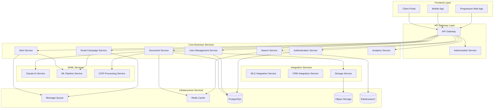
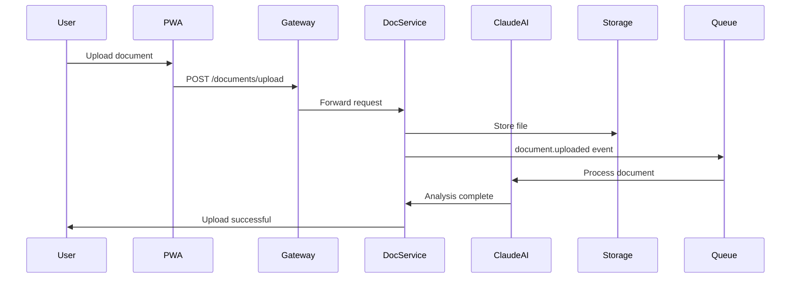
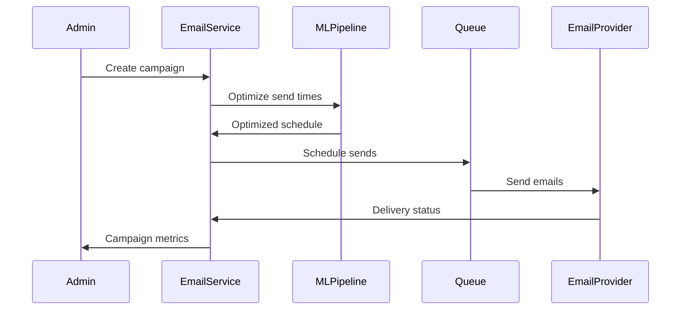

# 🏗️ Microservices Architecture Design
## Digital Docs Platform - ROI Systems POC

### Architecture Overview
Cloud-native microservices architecture designed for the Digital Docs platform, supporting the three core workflows: document management, forever marketing, and instant alerts. Built for scale, security, and Claude AI integration.

### Design Principles
- **Domain-Driven Design**: Services organized around business capabilities
- **API-First**: All services expose RESTful APIs with OpenAPI specs
- **Event-Driven**: Asynchronous communication via message queues
- **Cloud-Native**: Containerized, auto-scaling, resilient
- **Security by Design**: Zero-trust architecture with end-to-end encryption

---

## 🔧 Core Services Architecture

### Service Topology


---

## 🎯 Service Definitions

### 1. Authentication Service
**Purpose**: Secure user authentication and session management
**Technology**: Node.js + Express + JWT + Refresh Tokens

```yaml
Responsibilities:
  - JWT token generation/validation
  - Multi-factor authentication
  - Password reset workflows
  - Session management
  - OAuth2 integrations (Google, Microsoft)

API Endpoints:
  - POST /auth/login
  - POST /auth/refresh
  - POST /auth/logout
  - POST /auth/forgot-password
  - POST /auth/verify-mfa

Database Schema:
  - users: Basic auth info
  - sessions: Active sessions
  - mfa_tokens: MFA verification codes
  - oauth_connections: Third-party auth links

Performance Targets:
  - Login: <200ms
  - Token validation: <50ms
  - Availability: 99.9%
```

### 2. User Management Service
**Purpose**: User profiles, permissions, and agency management
**Technology**: Node.js + Express + PostgreSQL

```yaml
Responsibilities:
  - User profile management
  - Role-based access control (RBAC)
  - Agency/team management
  - Subscription management
  - User preferences

API Endpoints:
  - GET/PUT /users/{id}
  - GET/POST /agencies
  - GET/PUT /users/{id}/preferences
  - GET/POST /teams
  - GET/PUT /subscriptions

Database Schema:
  - users: Extended profile info
  - agencies: Agency details
  - teams: Team structures
  - roles: Permission definitions
  - subscriptions: Billing info

Performance Targets:
  - Profile updates: <300ms
  - Permission checks: <100ms
  - Availability: 99.9%
```

### 3. Document Service
**Purpose**: Core document management with Claude AI integration
**Technology**: Node.js + Express + PostgreSQL + S3

```yaml
Responsibilities:
  - Document upload/download
  - Version control
  - Access permissions
  - Claude AI integration for categorization
  - Metadata extraction
  - Audit trails

API Endpoints:
  - POST /documents/upload
  - GET /documents/{id}
  - PUT /documents/{id}/metadata
  - POST /documents/{id}/share
  - GET /documents/transactions/{id}

Claude AI Integration:
  - Document type detection
  - Data extraction (names, dates, amounts)
  - Smart categorization
  - Compliance checking
  - Content summarization

Database Schema:
  - documents: Core document info
  - document_versions: Version history
  - document_shares: Sharing permissions
  - document_metadata: AI-extracted data
  - audit_logs: Access tracking

Performance Targets:
  - Upload processing: <30s
  - Download: <2s
  - AI processing: <10s
  - Availability: 99.95%
```

### 4. Search Service
**Purpose**: Lightning-fast document search with Elasticsearch
**Technology**: Node.js + Elasticsearch + Redis

```yaml
Responsibilities:
  - Full-text search across documents
  - Faceted search capabilities
  - Auto-suggestions
  - Search analytics
  - Query optimization

API Endpoints:
  - GET /search/documents
  - GET /search/suggestions
  - POST /search/advanced
  - GET /search/recent

Search Features:
  - Full-text search with OCR content
  - Metadata filtering
  - Date range queries
  - Document type facets
  - Relevance scoring
  - Typo tolerance

Performance Targets:
  - Search results: <2s
  - Auto-suggestions: <200ms
  - Index updates: <5s
  - Availability: 99.9%
```

### 5. Email Campaign Service
**Purpose**: Forever marketing automation with ML personalization
**Technology**: Node.js + Express + Queue + ML Pipeline

```yaml
Responsibilities:
  - Campaign creation/management
  - Template system
  - ML-driven personalization
  - Send-time optimization
  - Performance tracking
  - A/B testing

API Endpoints:
  - POST /campaigns
  - GET /campaigns/{id}/metrics
  - POST /campaigns/{id}/send
  - GET/PUT /templates
  - POST /campaigns/test

ML Features:
  - Send-time optimization
  - Content personalization
  - Engagement prediction
  - Churn risk analysis
  - Subject line optimization

Database Schema:
  - campaigns: Campaign definitions
  - templates: Email templates
  - sends: Individual send records
  - opens: Open tracking
  - clicks: Click tracking

Performance Targets:
  - Campaign creation: <5s
  - Send processing: 10K emails/minute
  - Personalization: <500ms
  - Availability: 99.9%
```

### 6. Alert Service
**Purpose**: Instant business alerts with AI matching
**Technology**: Node.js + Express + Queue + ML Pipeline

```yaml
Responsibilities:
  - Alert configuration
  - MLS data monitoring
  - AI-powered matching
  - Multi-channel delivery
  - Response tracking
  - Conversion analytics

API Endpoints:
  - GET/POST /alerts/config
  - POST /alerts/test
  - GET /alerts/history
  - POST /alerts/response
  - GET /alerts/analytics

AI Features:
  - Property-client matching
  - Opportunity scoring
  - Timing optimization
  - Relevance prediction
  - Market trend analysis

Database Schema:
  - alert_configs: User alert settings
  - alert_history: Sent alerts
  - alert_responses: User interactions
  - market_data: MLS property data
  - match_scores: AI scoring results

Performance Targets:
  - Alert delivery: <1s
  - Matching accuracy: >85%
  - Response tracking: <100ms
  - Availability: 99.95%
```

### 7. Claude AI Service
**Purpose**: Central Claude AI integration hub
**Technology**: Python + FastAPI + Claude API

```yaml
Responsibilities:
  - Document analysis
  - Content generation
  - Data extraction
  - Natural language processing
  - Predictive modeling
  - API rate limiting

API Endpoints:
  - POST /ai/analyze-document
  - POST /ai/extract-data
  - POST /ai/categorize
  - POST /ai/summarize
  - POST /ai/personalize-content

AI Capabilities:
  - Document type classification
  - OCR text extraction
  - Entity recognition (names, dates, amounts)
  - Sentiment analysis
  - Content personalization
  - Compliance checking

Performance Targets:
  - Document analysis: <10s
  - Data extraction: <5s
  - Content generation: <3s
  - Availability: 99.9%
```

### 8. Analytics Service
**Purpose**: Real-time analytics and business intelligence
**Technology**: Node.js + ClickHouse + Redis

```yaml
Responsibilities:
  - Event tracking
  - Real-time metrics
  - Custom dashboards
  - Report generation
  - Predictive analytics
  - Data export

API Endpoints:
  - POST /analytics/events
  - GET /analytics/dashboards
  - GET /analytics/reports
  - POST /analytics/queries
  - GET /analytics/exports

Metrics Tracked:
  - User engagement
  - Document usage
  - Email performance
  - Alert effectiveness
  - System performance
  - Business KPIs

Performance Targets:
  - Event ingestion: <100ms
  - Dashboard load: <3s
  - Report generation: <30s
  - Availability: 99.9%
```

---

## 🔄 Inter-Service Communication

### Event-Driven Architecture
```yaml
Message Queue (Redis/RabbitMQ):
  Events:
    - document.uploaded
    - document.shared
    - user.registered
    - campaign.sent
    - alert.delivered
    - ai.analysis.complete
    
  Patterns:
    - Publish/Subscribe for notifications
    - Request/Reply for synchronous operations
    - Event Sourcing for audit trails
    - Dead letter queues for error handling
```

### API Communication Patterns
```yaml
Synchronous (REST):
  - User authentication
  - Document retrieval
  - Search queries
  - Real-time operations

Asynchronous (Events):
  - Document processing
  - Email campaigns
  - Analytics events
  - AI analysis tasks

Circuit Breaker Pattern:
  - Timeout: 30s
  - Failure threshold: 5 consecutive failures
  - Recovery time: 60s
```

---

## 🛠️ Technology Stack

### Core Technologies
```yaml
Backend Services:
  - Runtime: Node.js 18+ (JavaScript/TypeScript)
  - Framework: Express.js with Helmet security
  - Validation: Joi/Zod for request validation
  - Testing: Jest + Supertest

AI/ML Services:
  - Runtime: Python 3.11+
  - Framework: FastAPI
  - AI Integration: Claude API SDK
  - ML Libraries: scikit-learn, pandas

Databases:
  - Primary: PostgreSQL 15+ (ACID compliance)
  - Cache: Redis 7+ (session, search cache)
  - Search: Elasticsearch 8+ (document search)
  - Analytics: ClickHouse (time-series data)

Message Queue:
  - Primary: Redis Streams
  - Alternative: RabbitMQ for complex routing

Storage:
  - Object Storage: AWS S3 / MinIO
  - CDN: CloudFront for document delivery
```

### Infrastructure
```yaml
Containerization:
  - Runtime: Docker + Docker Compose
  - Orchestration: Kubernetes (production)
  - Service Mesh: Istio (optional)

Cloud Platforms:
  - Primary: AWS (ECS, RDS, ElastiCache)
  - Alternative: Docker Compose (local/staging)
  - CDN: CloudFront + S3

Monitoring:
  - Metrics: Prometheus + Grafana
  - Logging: ELK Stack (Elasticsearch, Logstash, Kibana)
  - Tracing: Jaeger for distributed tracing
  - Alerts: PagerDuty integration
```

---

## 📊 Scalability & Performance

### Auto-Scaling Configuration
```yaml
Horizontal Scaling:
  - API Gateway: 2-10 instances
  - Core Services: 2-20 instances each
  - AI Services: 1-5 instances (GPU consideration)
  - Workers: 2-50 instances based on queue length

Vertical Scaling:
  - Database: Read replicas for scaling reads
  - Cache: Redis Cluster for distributed caching
  - Search: Elasticsearch cluster with sharding

Load Balancing:
  - Application: HAProxy/NGINX
  - Database: PgBouncer connection pooling
  - Cache: Redis Sentinel for HA
```

### Performance Targets
```yaml
Response Times:
  - API Gateway: <100ms
  - Authentication: <200ms
  - Document retrieval: <2s
  - Search results: <2s
  - AI processing: <10s

Throughput:
  - API requests: 10K requests/second
  - Document uploads: 1K/minute
  - Email sends: 10K/minute
  - Concurrent users: 10K+

Availability:
  - Critical services: 99.95%
  - Non-critical services: 99.9%
  - Planned maintenance: <4 hours/month
```

---

## 🔒 Security Architecture

### Zero-Trust Security Model
```yaml
Authentication:
  - JWT tokens with short expiration (15 minutes)
  - Refresh tokens with rotation
  - MFA for administrative access
  - OAuth2 for third-party integrations

Authorization:
  - Role-Based Access Control (RBAC)
  - Attribute-Based Access Control (ABAC)
  - API-level permissions
  - Resource-level permissions

Network Security:
  - Service-to-service mTLS
  - VPC with private subnets
  - WAF for external traffic
  - Network segmentation
```

### Data Protection
```yaml
Encryption:
  - At Rest: AES-256 for all databases and storage
  - In Transit: TLS 1.3 for all communications
  - Application: Field-level encryption for PII

Compliance:
  - GDPR: Data portability and deletion
  - CCPA: Privacy rights and data access
  - SOC 2 Type II: Security controls audit
  - Real Estate Compliance: Industry-specific requirements
```

---

## 🚀 Deployment Strategy

### Environment Strategy
```yaml
Development:
  - Local Docker Compose
  - Hot reloading
  - Debug configurations
  - Mock external services

Staging:
  - AWS ECS or Kubernetes
  - Production-like data (anonymized)
  - Full integration testing
  - Performance testing

Production:
  - AWS ECS with auto-scaling
  - Multi-AZ deployment
  - Blue-green deployments
  - Automated rollback
```

### CI/CD Pipeline
```yaml
Build Stage:
  - Code quality checks (ESLint, Prettier)
  - Unit tests (Jest)
  - Security scanning (Snyk)
  - Docker image build

Test Stage:
  - Integration tests
  - API contract tests
  - Performance tests
  - Security tests (OWASP ZAP)

Deploy Stage:
  - Staging deployment
  - Smoke tests
  - Production deployment (manual approval)
  - Health checks and monitoring
```

---

## 📈 Monitoring & Observability

### Application Metrics
```yaml
Business Metrics:
  - User registrations/day
  - Document uploads/day
  - Email open rates
  - Alert conversion rates
  - Revenue per user

Technical Metrics:
  - Response times (P50, P95, P99)
  - Error rates by service
  - Throughput (requests/second)
  - Database performance
  - Queue lengths

System Metrics:
  - CPU/Memory utilization
  - Disk I/O
  - Network traffic
  - Container health
```

### Alerting Strategy
```yaml
Critical Alerts (PagerDuty):
  - Service availability < 99%
  - Response time > 10s
  - Error rate > 5%
  - Database connection failures

Warning Alerts (Slack):
  - Response time > 5s
  - Error rate > 1%
  - Disk usage > 80%
  - Queue backlog > 1000

Informational (Email):
  - Daily performance reports
  - Weekly business metrics
  - Monthly security reports
```

---

## 🔄 Data Flow Diagrams

### Document Upload Flow


### Email Campaign Flow


---

## 📋 Implementation Priorities

### Phase 1: Core Services (Weeks 1-4)
1. **Authentication Service** - Foundation for all access
2. **User Management Service** - Basic user operations
3. **Document Service** - Core document management
4. **API Gateway** - Unified entry point

### Phase 2: AI Integration (Weeks 5-8)
1. **Claude AI Service** - Document intelligence
2. **Search Service** - Fast document retrieval
3. **Storage Service** - Scalable file management
4. **OCR Processing** - Document text extraction

### Phase 3: Marketing Features (Weeks 9-12)
1. **Email Campaign Service** - Marketing automation
2. **Alert Service** - Business notifications
3. **Analytics Service** - Performance tracking
4. **ML Pipeline** - Personalization engine

### Phase 4: Optimization (Weeks 13-16)
1. **Performance tuning** - Sub-2s response times
2. **Security hardening** - Production readiness
3. **Monitoring setup** - Full observability
4. **Load testing** - Scalability validation

---

**Architecture Design By**: System Architecture Team  
**Reviewed By**: CTO, Security Team, DevOps Team  
**Last Updated**: Week 2, Day 1  
**Next Review**: End of Week 2

*Note: This architecture will be refined based on POC development progress and pilot agency feedback.*